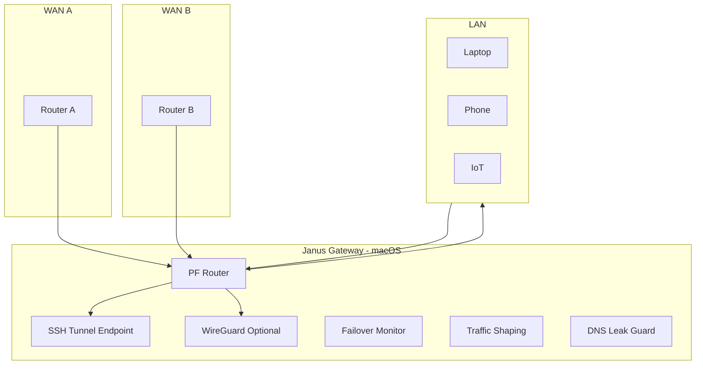

# ADR-001: Naming and Scope of janus-gateway

## Status
Accepted

## Context
A macOS-based home server must act as:
- a stable outbound SSH tunnel endpoint,
- a PF-powered traffic gateway,
- a dual-uplink failover router,
- an optional WireGuard endpoint ("Hybrid Mode"),
- and a general-purpose secure home egress controller.

The system must:
- be lightweight enough for M2 Mac Mini with 8GB RAM,
- support multi-ISP homes with two routers,
- expose only minimal attack surface,
- follow deterministic, declarative configuration.

## Decision
The project will be named **janus-gateway**.

Reasons:
- Janus represents directional duality, matching the gateway’s dual-uplink function.
- The name is technically appropriate, clear, unique, and repo-friendly.
- "gateway" clarifies the system’s network-layer focus.

## Consequences
- All documentation, scripts, and configs will reference `janus-gateway` as the canonical name.
- Hostname recommendations: `janus`, `janus-gw`, or `janus-home`.
- Subprojects and CI pipelines will use the same naming convention.

## Architecture Diagram

